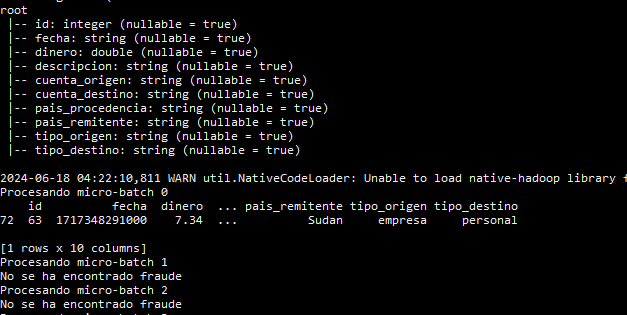
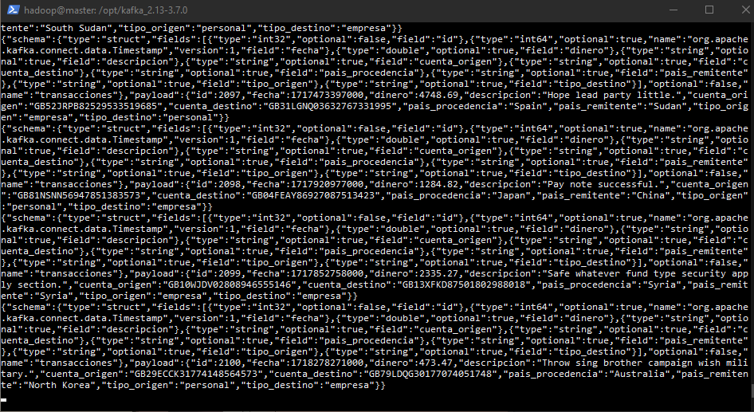
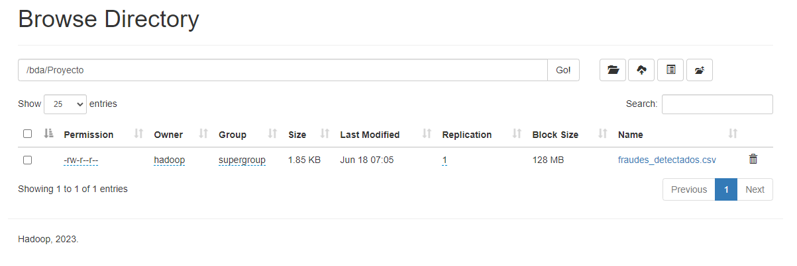
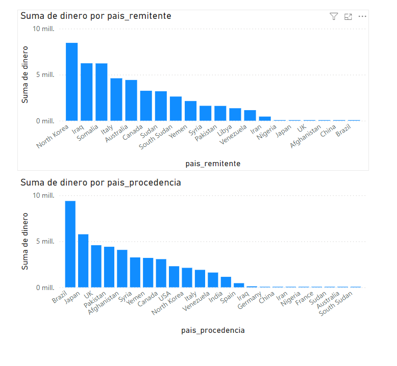
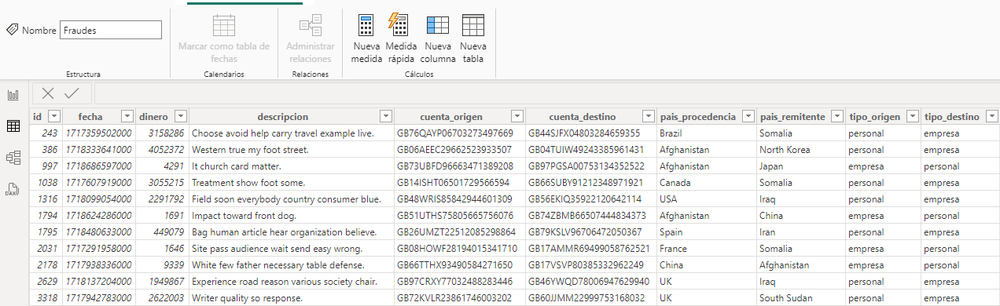

# Big Data Aplicado
## Proyecto Final
### Deteción de Fraude en Transacciones Bancarias


1. Funcionalidad del Proyecto

> El proyecto se basa en detectar transacciones fraudulentas en un conjunto de datos de transacciones bancarias. Como vemos a continuación, el conjunto de datos contiene información sobre las transacciones realizadas, incluyendo la fecha, el monto, la descripción, las cuentas de origen y destino, y los países de procedencia y destino. El objetivo es identificar las transacciones que son inusuales o sospechosas, lo que podría indicar un fraude. Para ello, se utilizarán técnicas de análisis de datos y aprendizaje automático para identificar patrones y anomalías en los datos. 
   
```python
import time
import random
from faker import Faker
import mysql.connector

# Configuración de la conexión a la base de datos
config = {
    'host': '192.168.137.8',
    'user': 'root',
    'password': 'usuario',
    'database': 'transacciones_bancarias',
    'port': 3306
}
# Creamos una instancia de Faker
faker = Faker()

# Lista de países, incluyendo algunos de alto riesgo
paises = [
    "Afghanistan", "Iran", "Iraq", "North Korea", "Syria", "Venezuela", "Yemen",
    "Libya", "Somalia", "South Sudan", "Sudan", "Pakistan", "Nigeria",
    "USA", "Canada", "UK", "Germany", "France", "Italy", "Spain", "Australia",
    "Brazil", "India", "China", "Japan"
]

paises_alto_riesgo = [
    "Afghanistan", "Iran", "Iraq", "North Korea", "Syria", "Venezuela", "Yemen",
    "Libya", "Somalia", "South Sudan", "Sudan", "Pakistan", "Nigeria"
]

# Generamos un conjunto de cuentas con perfiles (personal o empresa)
def generar_cuentas(num_cuentas=10000):
    cuentas = []
    for _ in range(num_cuentas):
        cuenta = faker.iban()
        pais = random.choice(paises)
        perfil = random.choices(["personal", "empresa"], [0.7, 0.3])[0]  # 70% personal, 30% empresa
        cuentas.append((cuenta, pais, perfil))
    return cuentas

cuentas = generar_cuentas()

# Función para seleccionar una cuenta basada en su perfil
def seleccionar_cuenta(perfil):
    cuenta, pais, _ = random.choice([cuenta for cuenta in cuentas if cuenta[2] == perfil])
    return cuenta, pais

# Función para generar un monto basado en el perfil de las cuentas
def generar_monto(perfil_origen, perfil_destino, is_fraud=False):
    if perfil_origen == "personal" and perfil_destino == "empresa":
        if is_fraud:
            return round(random.uniform(10000, 50000), 2)  # Transacción fraudulenta: monto inusualmente alto
        else:
            return round(random.uniform(1, 2000), 2)  # Transacción normal: pequeñas cantidades de dinero
    elif perfil_origen == "empresa" and perfil_destino == "personal":
        if is_fraud:
            return round(random.uniform(1, 100), 2)  # Transacción fraudulenta: monto inusualmente bajo
        else:
            return round(random.uniform(1000, 5000), 2)  # Transacción normal: salarios u otros pagos más altos
    else:
        return round(random.uniform(1, 10000), 2)  # Otros casos, transacciones normales con montos variados

# Función para generar una transacción aleatoria
def generar_transaccion():
    fecha = faker.date_time_this_month()
    perfil_origen, perfil_destino = random.choices(["personal", "empresa"], k=2)
    cuenta_origen, pais_procedencia = seleccionar_cuenta(perfil_origen)
    cuenta_destino, pais_remitente = seleccionar_cuenta(perfil_destino)
    monto = generar_monto(perfil_origen, perfil_destino)
    descripcion = faker.text(max_nb_chars=50)
    return [fecha, monto, descripcion, cuenta_origen, cuenta_destino, pais_procedencia, pais_remitente, perfil_origen, perfil_destino]

# Función para generar una transacción fraudulenta
def generar_transaccion_fraudulenta():
    fecha = faker.date_time_this_month(before_now=True, after_now=False)
    descripcion = faker.text(max_nb_chars=50)

    # Patrón de fraude: uso inusual de cuentas y países
    if random.random() < 0.5:
        # Pago elevado de cuenta empresa a cuenta personal
        perfil_origen, perfil_destino = "empresa", "personal"
    else:
        # Pago elevado de cuenta personal a cuenta empresa
        perfil_origen, perfil_destino = "personal", "empresa"

    cuenta_origen, pais_procedencia = seleccionar_cuenta(perfil_origen)
    cuenta_destino, pais_remitente = seleccionar_cuenta(perfil_destino)
    monto = generar_monto(perfil_origen, perfil_destino, is_fraud=True)

    # Mayor probabilidad de que el país de destino sea de alto riesgo
    if random.random() < 0.7:
        pais_remitente = random.choice(paises_alto_riesgo)
    else:
        pais_remitente = random.choice(paises)

    return [fecha, monto, descripcion, cuenta_origen, cuenta_destino, pais_procedencia, pais_remitente, perfil_origen, perfil_destino]

def insertar_transaccion(cursor, transaccion):
    cursor.execute("""
        INSERT INTO transacciones (fecha, dinero, descripcion, cuenta_origen, cuenta_destino, pais_procedencia, pais_remitente, tipo_origen, tipo_destino)
        VALUES (%s, %s, %s, %s, %s, %s, %s, %s, %s)
    """, transaccion)

def main():
    num_transacciones_totales = 0
    try:
        while True:
            # Conectar a la base de datos
            cnx = mysql.connector.connect(**config)
            cursor = cnx.cursor()

            for _ in range(1000):
                # Generar una transacción aleatoria o fraudulenta
                if random.random() < 0.01:  # 1% de probabilidad de ser fraudulenta
                    transaccion = generar_transaccion_fraudulenta()
                else:
                    transaccion = generar_transaccion()

                # Insertar la transacción en la base de datos
                insertar_transaccion(cursor, transaccion)

                # Confirmar los cambios
                cnx.commit()
                num_transacciones_totales += 1
                print(f"{num_transacciones_totales} transacciones escritas en total.")

                # Esperar 1 segundo antes de generar la siguiente transacción
                time.sleep(0.5)

            # Cerrar la conexión
            cursor.close()
            cnx.close()

            # Preguntar al usuario si desea continuar o parar cada 10 transacciones
            respuesta = input("¿Desea continuar generando transacciones? (s/n): ")
            if respuesta.lower() != 's':
                break

    except mysql.connector.Error as error:
        print("Error al insertar datos en la tabla transacciones:", error)
    finally:
        if 'cnx' in locals() and cnx.is_connected():
            cursor.close()
            cnx.close()
            print("Conexión a MySQL cerrada.")

if __name__ == "__main__":
    main()
```

2. Creacion de datos de entrenamiento

> Para entrenar el modelo de detección de fraudes, necesitamos un conjunto de datos de transacciones etiquetadas como fraudulentas o no fraudulentas. En este caso, generaremos un conjunto de datos de entrenamiento con transacciones simuladas, algunas de las cuales serán fraudulentas. Guardaremos este conjunto de datos en un archivo CSV para su posterior uso en el entrenamiento del modelo.

```python
import pandas as pd
from sklearn.model_selection import train_test_split
from sklearn.ensemble import RandomForestClassifier
from sklearn.metrics import classification_report
import joblib

def cargar_datos_entrenamiento(ruta_archivo):
    datos = pd.read_csv(ruta_archivo)
    datos = datos.drop(columns=['fecha', 'descripcion', 'cuenta_origen', 'cuenta_destino'])
    datos = pd.get_dummies(datos, columns=['pais_procedencia', 'pais_remitente', 'tipo_origen', 'tipo_destino'])
    X = datos.drop(columns=['fraude'])
    y = datos['fraude']
    X_train, X_test, y_train, y_test = train_test_split(X, y, test_size=0.2, random_state=42)
    return X_train, X_test, y_train, y_test

def entrenar_modelo_rf(X_train, y_train):
    modelo = RandomForestClassifier(n_estimators=200, random_state=42)
    modelo.fit(X_train, y_train)
    return modelo

def evaluar_modelo_rf(modelo, X_test, y_test):
    y_pred = modelo.predict(X_test)
    print("Reporte de clasificación para RandomForestClassifier:")
    print(classification_report(y_test, y_pred))

def main_rf():
    ruta_archivo = 'entrenamiento.csv'
    X_train, X_test, y_train, y_test = cargar_datos_entrenamiento(ruta_archivo)
    modelo = entrenar_modelo_rf(X_train, y_train)
    evaluar_modelo_rf(modelo, X_test, y_test)
    joblib.dump(modelo, 'random_forest_model.pkl')  # Guardar el modelo

    # Guardar las características del conjunto de entrenamiento
    feature_names = X_train.columns
    joblib.dump(feature_names, 'feature_names.pkl')  # Guardar las características

if __name__ == "__main__":
    main_rf()
```


3. Creación del Modelo

> Se utilizará un modelo de clasificación basado en Random Forest para detectar transacciones fraudulentas. El modelo se entrenará con un conjunto de datos de transacciones etiquetadas como fraudulentas o no fraudulentas. Se utilizarán características como el monto de la transacción, los países de procedencia y destino, y los tipos de cuentas de origen y destino para predecir si una transacción es fraudulenta o no. Guardaremos el modelo entrenado y las características utilizadas para posteriormente utilizarlos en la detección de fraudes en tiempo real.

```python	
import pandas as pd
from sklearn.model_selection import train_test_split
from sklearn.ensemble import RandomForestClassifier
from sklearn.metrics import classification_report
import joblib

def cargar_datos_entrenamiento(ruta_archivo):
    datos = pd.read_csv(ruta_archivo)
    datos = datos.drop(columns=['fecha', 'descripcion', 'cuenta_origen', 'cuenta_destino'])
    datos = pd.get_dummies(datos, columns=['pais_procedencia', 'pais_remitente', 'tipo_origen', 'tipo_destino'])
    X = datos.drop(columns=['fraude'])
    y = datos['fraude']
    X_train, X_test, y_train, y_test = train_test_split(X, y, test_size=0.2, random_state=42)
    return X_train, X_test, y_train, y_test

def entrenar_modelo_rf(X_train, y_train):
    modelo = RandomForestClassifier(n_estimators=200, random_state=42)
    modelo.fit(X_train, y_train)
    return modelo

def evaluar_modelo_rf(modelo, X_test, y_test):
    y_pred = modelo.predict(X_test)
    print("Reporte de clasificación para RandomForestClassifier:")
    print(classification_report(y_test, y_pred))

def main_rf():
    ruta_archivo = 'entrenamiento.csv'
    X_train, X_test, y_train, y_test = cargar_datos_entrenamiento(ruta_archivo)
    modelo = entrenar_modelo_rf(X_train, y_train)
    evaluar_modelo_rf(modelo, X_test, y_test)
    joblib.dump(modelo, 'random_forest_model.pkl')  # Guardar el modelo

    # Guardar las características del conjunto de entrenamiento
    feature_names = X_train.columns
    joblib.dump(feature_names, 'feature_names.pkl')  # Guardar las características

if __name__ == "__main__":
    main_rf()

```

4. Requisitos del Proyecto

    * 1 nodo maestro con 4GB de RAM y 2 CPUs.
    * 3 nodos maquinas virtuales linux con 2GB de RAM y 2 CPUs cada una.
    * Tener instalado msql para poder recoger los datos de las transacciones.
    * Tener configurado una red interna. En mi caso la direccion es 192.168.13.0/24 
        - Para el master 192.168.13.10
        - Para el nodo1 192.168.13.11
        - Para el nodo2 192.168.13.12
        - Para el nodo3 192.168.13.13
    * Tener instalado Spark, Kafka y Hdfs en el nodo maestro.
    

5. Esquema de la Base de Datos  
    ```sql	
    CREATE DATABASE transacciones_bancarias;
    USE transacciones_bancarias;
    CREATE TABLE transacciones (
        id INT PRIMARY KEY AUTO_INCREMENT,
        fecha DATETIME,
        dinero DOUBLE,
        descripcion TEXT,
        cuenta_origen VARCHAR(50),
        cuenta_destino VARCHAR(50),
        pais_procedencia VARCHAR(100),
        pais_remitente VARCHAR(100),
        tipo_origen VARCHAR(20),
        tipo_destino VARCHAR(20)
    );
    ```

6. Configuracion de Kafka

> Creamos las carpetas necesarias para el proyecto en el directorio de kafka
```bash
mkdir -p /opt/kafka/Proyecto/config
mkdir -p /opt/kafka/Proyecto/logs
```

> Hacemos 2 y 1 copia de los ficheros correspondientes de configuración para cada uno
```bash
cp config/kraft/controller.properties /opt/kafka/Proyecto/config/controller1.properties
cp config/kraft/broker.properties /opt/kafka/Proyecto/config/broker1.properties
cp config/kraft/broker.properties /opt/kafka/Proyecto/config/broker2.properties
```

> Configuarmos el controller1.properties
```bash
# Server Basics
process.roles=controller
node.id=1
controller.quorum.voters=1@localhost:9093
# Socket Server Settings
listeners=CONTROLLER://localhost:9093
controller.listener.names=CONTROLLER
# Log Basics
log.dirs=/opt/kafka/Proyecto/logs/controller1
```

> Configuramos el broker1.properties 
```bash
# Server Basics
process.roles=broker
node.id=2
controller.quorum.voters=1@localhost:9093
# Socket Server Settings
listeners=PLAINTEXT://192.168.13.10:9094
inter.broker.listener.name=PLAINTEXT
advertised.listeners=PLAINTEXT://192.168.13.10:9094
listener.security.protocol.map=CONTROLLER:PLAINTEXT,PLAINTEXT:PLAINTEXT,SSL:SSL,SASL_PLAINTEXT:SASL_PLAINTEXT,SASL_SSL:SASL_SSL
# Log Basics
log.dirs=/opt/kafka/Proyecto/logs/broker1
```   

> Configuramos el broker2.properties
```bash
# Server Basics
process.roles=broker
node.id=3
controller.quorum.voters=1@localhost:9093
# Socket Server Settings
listeners=PLAINTEXT://192.168.13.10:9095
inter.broker.listener.name=PLAINTEXT
advertised.listeners=PLAINTEXT://192.168.13.10:9095
# Log Basics
log.dirs=/opt/kafka/Proyecto/logs/broker2
```

> Inicializamos kafka
```bash
#Genera un cluster UUID 
KAFKA_CLUSTER_ID="$(bin/kafka-storage.sh random-uuid)"
echo $KAFKA_CLUSTER_ID

#Formateamos los directorios de log
bin/kafka-storage.sh format -t $KAFKA_CLUSTER_ID -c /opt/kafka/Proyecto/config/controller1.properties_MJP
bin/kafka-storage.sh format -t $KAFKA_CLUSTER_ID -c /opt/kafka/Proyecto/config/broker1.properties_MJP
bin/kafka-storage.sh format -t $KAFKA_CLUSTER_ID -c /opt/kafka/Proyecto/config/broker2.properties_MJP
```

> Iniciamos los server(1 controller y 2 brokers) cada uno en una terminal diferente
```bash
#Ejecuta el servidor Kafka
bin/kafka-server-start.sh /opt/kafka/Proyecto/config/controller1.properties_MJP
bin/kafka-server-start.sh /opt/kafka/Proyecto/config/broker1.properties_MJP
bin/kafka-server-start.sh /opt/kafka/Proyecto/config/broker2.properties_MJP  
```

> Creamos el topic
```bash
bin/kafka-topics.sh --create --topic transacciones-transacciones --bootstrap-server 192.168.13.10:9094 --replication-factor 2 --partitions 2
```

7. Configuracion de kafka connect

> Vamos a levantar 3 workers, para cumplir una correcta Alta disponibilidad, Balanceo de carga y Escalabilidad. Guardados en /opt/kafka/Proyecto/config
```bash
# worker1.properties
bootstrap.servers=localhost:9094,localhost:9095
group.id=connect-cluster
key.converter=org.apache.kafka.connect.json.JsonConverter
value.converter=org.apache.kafka.connect.json.JsonConverter
key.converter.schemas.enable=true
value.converter.schemas.enable=true
config.storage.topic=connect-configs
offset.storage.topic=connect-offsets
status.storage.topic=connect-status
config.storage.replication.factor=2
offset.storage.replication.factor=2
status.storage.replication.factor=2
plugin.path=/opt/kafka/Proyecto/libs
listeners=http://localhost:8083

# worker2.properties
bootstrap.servers=localhost:9094,localhost:9095
group.id=connect-cluster
key.converter=org.apache.kafka.connect.json.JsonConverter
value.converter=org.apache.kafka.connect.json.JsonConverter
key.converter.schemas.enable=true
value.converter.schemas.enable=true
config.storage.topic=connect-configs
offset.storage.topic=connect-offsets
status.storage.topic=connect-status
config.storage.replication.factor=2
offset.storage.replication.factor=2
status.storage.replication.factor=2
plugin.path=/opt/kafka/Proyecto/libs
listeners=http://localhost:8084

# worker3.properties
bootstrap.servers=localhost:9094,localhost:9095
group.id=connect-cluster
key.converter=org.apache.kafka.connect.json.JsonConverter
value.converter=org.apache.kafka.connect.json.JsonConverter
key.converter.schemas.enable=true
value.converter.schemas.enable=true
config.storage.topic=connect-configs
offset.storage.topic=connect-offsets
status.storage.topic=connect-status
config.storage.replication.factor=2
offset.storage.replication.factor=2
status.storage.replication.factor=2
plugin.path=/opt/kafka/Proyecto/libs
listeners=http://localhost:8085
```

> Iniciamos los workers
```bash
bin/connect-distributed.sh /opt/kafka/Proyecto/config/worker1.properties
bin/connect-distributed.sh /opt/kafka/Proyecto/config/worker2.properties
bin/connect-distributed.sh /opt/kafka/Proyecto/config/worker3.properties
```

> Comprobamos que los workers estan funcionando
```bash
curl http://localhost:8083/connectors
curl http://localhost:8084/connectors
curl http://localhost:8085/connectors

# Podemos ver también la lista de plugins y conectores que los workers tienen a su disposición
curl http://localhost:8083/connector-plugins | jq
curl http://localhost:8084/connector-plugins | jq
curl http://localhost:8085/connector-plugins | jq
```


8. Creacion de la conexion entre mysql y kafka

> Creamos el fichero de configuracion de la conexion
```bash
{
  "name": "mysql-employees-source-connector",
  "config": {
    "connector.class": "io.confluent.connect.jdbc.JdbcSourceConnector",
    "tasks.max": "3",
    "connection.url": "jdbc:mysql://192.168.13.10:3306/transacciones_bancarias",
    "connection.user": "root",
    "connection.password": "usuario",
    "table.whitelist": "transacciones",
    "mode": "incrementing",
    "incrementing.column.name": "id",
    "topic.prefix": "transacciones-",
    "logs.dir": "/opt/kafka/Proyecto/logs/JdbcSource",
    "poll.interval.ms": "5000"
  }
}
```
> Opciones del conector
```bash
# Comprobamos los conectores activos,
curl http://localhost:8083/connectors

# Ejecuta el conector
curl -X POST -H "Content-Type: application/json" --data @/opt/kafka/Proyecto/config/mysql-employees-source-connector.json http://192.168.13.10:8083/connectors

# Elimina el conector
curl -X DELETE http://192.168.13.10:8083/connectors/mysql-employees-source-connector

# Muestra el estado del conector
curl http://localhost:8083/connectors/mysql-employees-source-connector/status
```

9. Visualizacion del consumo de datos

> Consumimos los datos de kafka
```bash
bin/kafka-console-consumer.sh --topic transacciones-transacciones --from-beginning --bootstrap-server 192.168.13.10:9094
```

10. Configuracion de Spark

> Lanzamos spark master y los workers del cluster.
```bash
hadoop@master:/opt/hadoop-3.3.6/spark-3.5.0$ ./sbin/start-master.sh 
hadoop@master:/opt/hadoop-3.3.6/spark-3.5.0$ ./sbin/start-workers.sh
```

> Descargamos las librerias necesarias para la conexion con kafka en mi caso: 
```bash
pip install pyspark
pip install joblib
pip install pandas
```

> Creamos el archivo que ejecutaremos en spark y mandara los datos a HDFS
```python
from pyspark.sql import SparkSession
from pyspark.sql.functions import from_json, col
from pyspark.sql.types import StructType, StructField, StringType, IntegerType, DoubleType
import joblib
import pandas as pd
import os

# Configuración de Kafka
KAFKA_SERVER = '192.168.13.10:9094'
ACCESS_LOG_TOPIC = 'transacciones-transacciones'
# Ruta local y en HDFS para el archivo CSV acumulativo
local_csv_path = "fraudes_detectados.csv"
hdfs_csv_path = "hdfs://cluster-bda:9000/bda/Proyecto/fraudes_detectados.csv"

# Definir el esquema para los datos de Kafka
schema = StructType([
    StructField("payload", StructType([
        StructField("id", IntegerType(), False),
        StructField("fecha", StringType(), True),
        StructField("dinero", DoubleType(), True),
        StructField("descripcion", StringType(), True),
        StructField("cuenta_origen", StringType(), True),
        StructField("cuenta_destino", StringType(), True),
        StructField("pais_procedencia", StringType(), True),
        StructField("pais_remitente", StringType(), True),
        StructField("tipo_origen", StringType(), True),
        StructField("tipo_destino", StringType(), True)
    ]), False)
])

# Inicializar la sesión de Spark
spark = SparkSession.builder \
    .appName("VisualizarDatosKafka") \
    .getOrCreate()

# Cargar el modelo y las características
modelo = joblib.load('random_forest_model.pkl')
feature_names = joblib.load('feature_names.pkl')

# Set Spark logging level to ERROR to avoid varios otros logs en consola.
spark.sparkContext.setLogLevel("ERROR")

# Leer datos desde Kafka como stream
df = spark \
    .readStream \
    .format("kafka") \
    .option("kafka.bootstrap.servers", KAFKA_SERVER) \
    .option("subscribe", ACCESS_LOG_TOPIC) \
    .option("startingOffsets", "earliest") \
    .load()

# Convertir los datos JSON de Kafka al DataFrame con el esquema definido
data_df = df.selectExpr("CAST(value AS STRING) as json") \
            .select(from_json(col("json"), schema).alias("data")) \
            .select("data.payload.*")

# Mostrar el esquema del DataFrame para verificar la estructura de los datos
data_df.printSchema()

# Función para predecir con el modelo
def predecir(df, batch_id):

    datos_originales = df.toPandas()

    # DataFrame para el modelo: solo los datos relevantes (con id)
    df_modelo = df.select("dinero", "pais_procedencia", "pais_remitente", "tipo_origen", "tipo_destino")

    # Convertir a Pandas DataFrame
    pd_df = df_modelo.toPandas()

    pd_df = pd.get_dummies(pd_df, columns=['pais_procedencia', 'pais_remitente', 'tipo_origen', 'tipo_destino'])

    # Reindexar las columnas para asegurarse de que coinciden con las características usadas en el entrenamiento
    pd_df = pd_df.reindex(columns=feature_names, fill_value=0)

    # Predecir utilizando el modelo
    predicciones = modelo.predict(pd_df)

    # Verificar si se ha detectado fraude
    if (predicciones == 1).any():
        fraude_detectado = datos_originales[predicciones == 1]

        # Convertir a Pandas DataFrame y concatenar con el archivo acumulativo local
        if os.path.exists(local_csv_path):
            fraude_detectado.to_csv(local_csv_path, mode='a', header=False, index=False)
        else:
            fraude_detectado.to_csv(local_csv_path, index=False)

        # Escribir el archivo acumulativo en HDFS sobrescribiendo el anterior
        os.system(f"hdfs dfs -put -f {local_csv_path} {hdfs_csv_path}")

    else:
        fraude_detectado = "No se ha encontrado fraude"

    print(f"Procesando micro-batch {batch_id}")
    print(fraude_detectado)

query = data_df \
    .writeStream \
    .outputMode("append") \
    .foreachBatch(predecir) \
    .start()

query.awaitTermination()
```

> Ejecutamos el archivo en spark
```bash
spark-submit --packages org.apache.spark:spark-sql-kafka-0-10_2.12:3.5.0 --master spark://192.168.13.10:7077 deteccion_fraudes.py
```

> A continuacion ejecutariamos nuestro consumer y veriamos como spark va detectando los fraudes y los va guardando en HDFS
> Vemos la salida en la consola de spark


> Vemos la salida del consumer


> Vemos los datos en HDFS


11. Por ultimo podemos visualizar los datos PowerBI
> Después de conectar PowerBI con HDFS, podemos visualizar los datos de fraude detectados en tiempo real.


> Con esta visulaizacion de los datos podemos ver de que paises provienen los fraudes y a que cuentas van dirigidos. Y la cantidad de dinero que se a movido por pais. 

> PowerBI tambien nos permite visulaizra una tabla con todos los datos con la que podremos investigar más a fondo los fraudes detectados.


12. En el repositorio hay un video de muestra.


